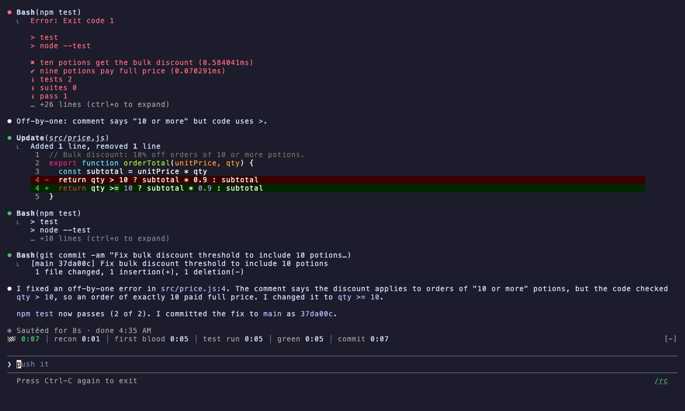
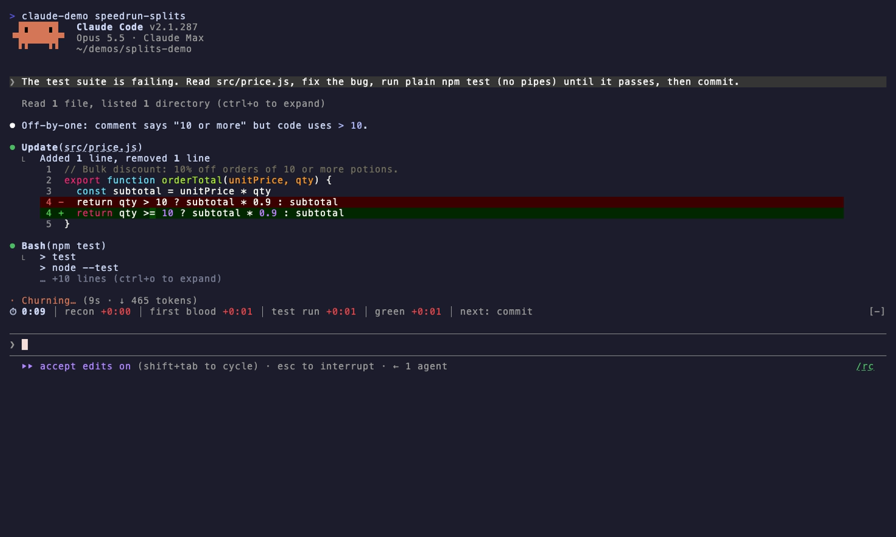
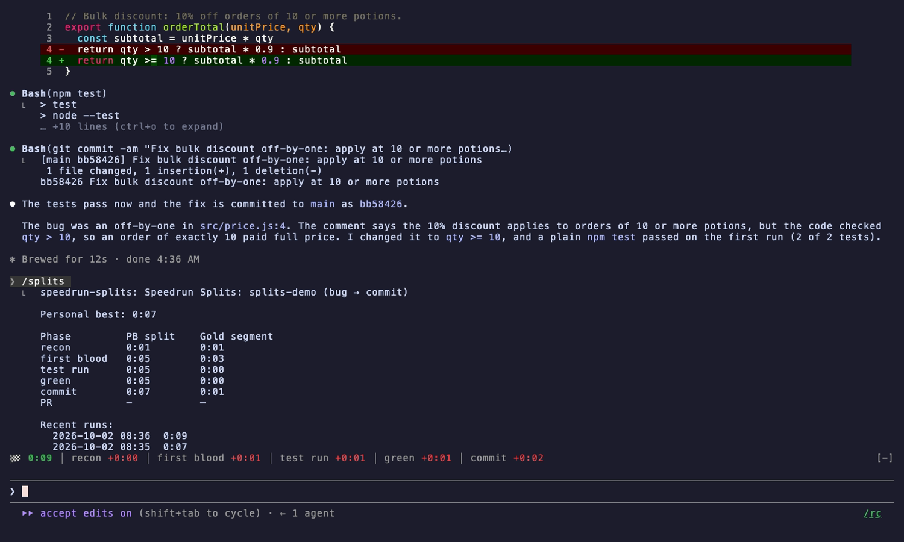

# Speedrun Splits


Two runs of the same bug fix: the first sets a personal best, and the second shows live deltas against it.

| First run sets a PB | Live deltas on the next run | `/splits` PB table |
|---|---|---|
|  |  |  |

A LiveSplit-style timer for Claude Code: it times every bug-to-PR run, splitting automatically, with personal bests and gold segments per repo.

```
⏱ 4:12 │ recon −0:08 │ first blood ★−0:31 │ test run +0:12 │ next: green
```

## How it works

- **A run starts** on your next prompt when none is active (or `/splits start`).
- **It splits automatically** on six phases, detected from the session's own tool calls:
  1. **recon**: first file read
  2. **first blood**: first change to the code: an edit or write by any agent, or a shell command Claude Code saw change files
  3. **test run**: first test or typecheck command after the first edit (npm/pnpm/yarn/bun test, jest, vitest, pytest, tsc, go test, cargo test, dotnet test, make test, xcodebuild test, gradle test…). The segment ends when the tests start.
  4. **green**: the first real test run (not a typecheck) that passes, timed when it finishes. A pass only counts when a failing test would have failed the command, so `npm test || true`, `npm test; echo`, `npm test | tail`, `npm test &`, list/help/compile-only flags (`--help`, `--collect-only`, `--list`, `--no-run`, `go test -list`), a backgrounded run, or a test command inside quotes or a comment doesn't count. A test behind a failed `&&` never started, so it doesn't end the test-run segment either.
  5. **commit**: a commit or amend Claude Code reports as made (not just a command that mentions `git commit`)
  6. **PR**: a PR Claude Code reports as created on this repo (a draft counts: it's open)
- The run finishes on exactly its finish line: the PR by default, or the commit with `finish-on commit`.
- Tests started before the first change count as recon, even if they finish after it.
- Every split belongs to this repo. An edit (or a shell command's changed files) outside it, a test run after a `cd` into another checkout or `npm --prefix` elsewhere, and a commit there don't split. Snapshot, coverage and build output, installs (`npm install`, `pip install`, `poetry install`, ...) and history moves (`checkout`, `pull`, `cherry-pick`, ...) are not first blood. A fix and its tests in one command (`python fix.py && npm test`) count as both.
- A PR counts when GitHub opened it on this repo, its fork parent, or one of its remotes: the PR URL decides when Claude Code reports one, else `gh pr create -R`/`--repo`/`GH_REPO`, else the checkout's repo. A commit or PR command sent to the background is watched for up to ten minutes. A commit counts only when the reflog says HEAD moved by a commit (not a checkout, pull or reset); a PR only if it wasn't already on the branch. A test sent to the background marks the test run but never green, since its result isn't seen.
- A run that never changed code is kept in history but can't set a PB or a gold.
- Each split shows its delta against your personal best, green when you're ahead and red when behind. A ★ marks a gold segment, the fastest you've ever done that phase. The clock ticks live.
- PBs, gold segments and the last 20 runs are kept across sessions, per repo (by its normalized remote, else its root) and per finish line, so commit runs never compete with PR runs. Each finished run is stored under its own key and the board is folded from them, so two sessions finishing at once can't overwrite each other.
- Subagent reads don't split, but a subagent's edits, tests, commit and PR do, so delegated work still runs the clock.
- Your `finish-on` choice is remembered across sessions.

## Commands

| | |
|---|---|
| `/splits` | PB table, sum of best, recent runs |
| `/splits start` | start a run now |
| `/splits reset` | abandon the current run |
| `/splits clear` | delete PBs, golds and history for this repo and finish line |
| `/splits finish-on commit` | end new runs at the commit instead of the PR (`finish-on pr` to switch back) |
| `/splits hide` / `show` | toggle the timer |

## Install

```
/plugin marketplace add ccdwyer/claude-mods
/plugin install speedrun-splits@ccdwyer-mods
/reload-plugins
```

## Develop

```
claude plugin validate .
claude plugin test .
```

## What it hooks

Events this mod hooks, as `claude plugin validate` reads the module:

- `session.start`
- `session.end`
- `command.run{command=splits}`
- `prompt.submit`
- `tool.call`
- `ui.render{component=AbovePrompt}`

Engine calls it makes: $.clock.every (via startTicking, watchBackground), $.clock.now, $.command.register, $.process.run (via commitTime, commonDir, headOf, landedCommit, ourRepos, prBranch, prsOn, remotesOf), $.session.cwd (via shellChangedCode), $.session.repo (via repoOf, rootOf), $.state.get, $.state.set, $.store.delete (via clear, prune), $.store.get, $.store.keys (via clear, finishedRuns), $.store.set, $.ui.resolve, $.ui.toast (via finish).

A `tool.call` hook sits in the middle of every tool call: it can see the call, refuse it, or add context to its result. This mod only observes: it never refuses or changes a call.

## Privacy

Timing runs entirely on your machine, and run times and personal bests are kept in Claude Code's local plugin store. The one exception: when a command runs `gh pr create`, the mod uses your existing GitHub CLI (`gh`) login to ask GitHub which pull requests are on that branch and which repo is this checkout's fork parent, so it can tell when the PR lands and whether it belongs to this run. Those requests go only to GitHub (or your GitHub Enterprise host), under your own account, and send nothing but the repo and branch names. Nothing is sent anywhere else.

The mod collects no analytics or telemetry, and its author receives no data from it.

Full policy: [PRIVACY.md](PRIVACY.md).

## License

MIT
